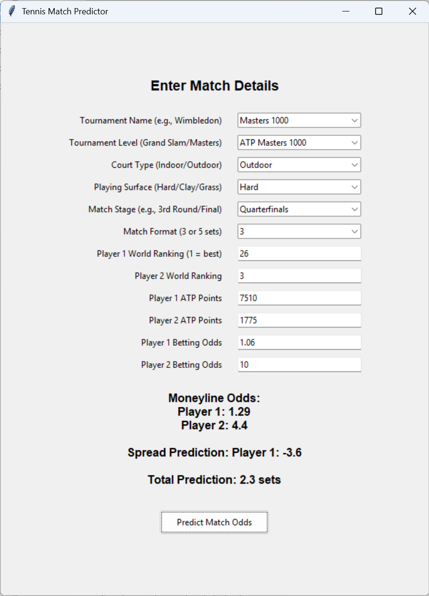

# Tennis Match Odds Prediction System


A machine learning system that predicts tennis match outcomes (moneyline odds, game spread, and total sets) using CatBoost models. Includes both training scripts and a GUI interface for predictions.

## Features

- **Three Prediction Models**:
  - Moneyline (win probability)
  - Game spread prediction
  - Total sets prediction
- **Advanced Feature Engineering**:
  - Historical match analysis
  - Player ranking differentials
  - Surface/court type considerations
- **Model Interpretability**:
  - SHAP value analysis
  - Feature importance visualizations
- **User-Friendly GUI**:
  - Interactive input form
  - Real-time predictions

## Requirements

- Python 3.7+
- Required Packages:
  ```text
  catboost==1.0.6
  pandas>=1.1.0
  scikit-learn>=0.24.0
  numpy>=1.19.0
  matplotlib>=3.3.0
  shap>=0.39.0
## Installation

1. Clone repository:
   ```bash
   git clone https://github.com/yourusername/tennis-odds-predictor.git
   cd tennis-odds-predictor
   ```

2. Install dependencies:
   ```bash
   pip install -r requirements.txt
   ```

## Usage

### Training the Models

1. Prepare your dataset:
   - CSV format with historical match data
   - Required columns: `Score`, `Winner`, `Rank_1`, `Rank_2`, etc.
   - Update file path in `train.py`

2. Run training script:
   ```bash
   python train.py
   ```

This will:
- Perform data preprocessing
- Train three CatBoost models
- Generate evaluation metrics
- Save models (`*.cbm` files)

### Making Predictions (GUI)

```bash
python gui.py
```



**Input Fields**:
- Tournament details (name, series, court type)
- Player rankings and ATP points
- Historical betting odds
- Match format (best-of sets)

**Output Predictions**:
- Player win probabilities
- Predicted game spread
- Expected total sets

## How It Works

### Data Pipeline

1. **Feature Engineering**:
   - Calculates game/set differentials
   - Creates ranking/points ratios
   - Processes match scores into actionable features

2. **Preprocessing**:
   - Outlier removal (Z-score thresholding)
   - Missing value handling
   - Categorical feature optimization

3. **Model Training**:
   - Time-series aware data split (80/20)
   - Hyperparameter tuning with RandomizedSearchCV
   - Class balancing for moneyline predictions

### Model Architecture

| Model Type       | Algorithm          | Target Variable       | Key Metrics            |
|------------------|--------------------|-----------------------|------------------------|
| Moneyline        | CatBoostClassifier | Binary Win/Loss       | AUC-ROC, Log Loss      |
| Game Spread      | CatBoostRegressor  | Game Differential     | RMSE, MAE              |
| Total Sets       | CatBoostRegressor  | Total Sets Played     | RMSE, R² Score         |

### Key Features

- **Dynamic Feature Calculation**:
  ```python
  def calculate_match_features(row):
      # Extracts 7 key metrics from match score
      sets = parse_score(row['Score'])
      return pd.Series([
          p1_games, p2_games, total_sets,
          p1_sets, p2_sets, max_games,
          int(row['Winner'] == row['Player_1'])
      ])
  ```

- **Model Interpretability**:
  ```python
  # SHAP Value Analysis
  explainer = shap.TreeExplainer(ml_model)
  shap_values = explainer.shap_values(X_test)
  shap.summary_plot(shap_values, X_test)
  ```

## Contributing

1. Fork the repository
2. Create your feature branch:
   ```bash
   git checkout -b feature/new-feature
   ```
3. Commit changes:
   ```bash
   git commit -m 'Add some feature'
   ```
4. Push to branch:
   ```bash
   git push origin feature/new-feature
   ```
5. Open a Pull Request

## License

Distributed under the MIT License. See `LICENSE` for more information.

## Acknowledgements

- CatBoost for gradient boosting implementation
- SHAP for model interpretability
- ATP Tour for historical match data
